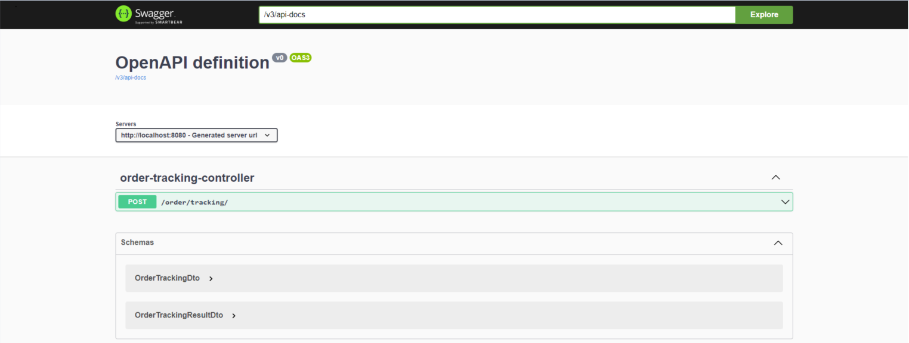
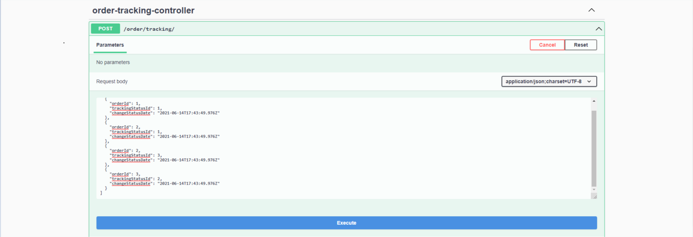
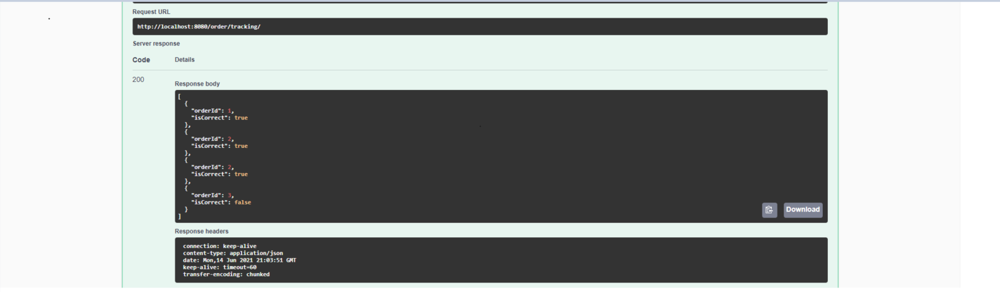
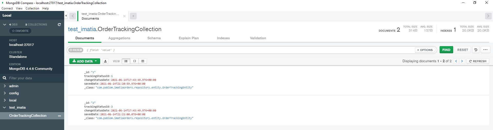

# Imatia Orders

## Sobre el proyecto

Este es un proyecto de prueba para Imatia, es una aplicación que expone un API REST para almacenar estados de un pedido

### Construído con

* [Spring Boot](https://github.com/spring-projects/spring-boot)
    * [test container](https://github.com/testcontainers/testcontainers-java/)
    * [Swagger](https://swagger.io/)
    * [OpenAPI-generator](https://github.com/OpenAPITools/openapi-generator/tree/master/modules/openapi-generator-maven-plugin)
* [Docker](https://docs.docker.com/engine/)
* [docker-compose](https://github.com/docker/compose)

### Acerca del proyecto

Esta aplicación sigue el principio de API-FIRST, es decir escribir un "contrato" para consensuar los métodos de la API para los posibles
futuros consumidores.

La aplicación se divide en tres capas: controlador, servicio y repositorio.

-El **controlador** implementa la interfaz facilitada por el generador de OpenAPI.

-El **servicio** se implementa mediante un patrón Facade para desacoplar la validación de la máquina de estados de las operaciones contra el
repositorio.

-El **repositorio** utiliza Spring Data y Spring JPA para realizar las operaciones contra el repositorio.

La parte de **test** utiliza "testcontainer" para levantar una imagen de MongoDB y ejecutar los test contra él. El proyecto está cubierto con
test entre un 70% (métodos) y un 86% (clases).


### Prerrequisitos

Es necesario tener instalado **git**, **docker** y **docker-compose**. Con estas tres herramientas solo es necesario descargar el proyecto y 
ejecutar un scrip de bash.

### Instalación

1. Clonar repositorio
   ```sh
   git clone https://github.com/pablomoure/imatia-orders imatia-orders
   cd imatia-orders
   ```
2. Levantar aplicación y docker-compose
   ```sh
   bash start-up.sh
   ```
3. Acceder desde un navegador a [esta url](http://localhost:8080/swagger-ui.html)


## Uso

1. En un navegador introducimos http://localhost:8080/swagger-ui.html para acceder a la UI de Swagger para realizar consultas de forma más
intuitiva.



2. En la sección **POST /order/tracking/** pulsamos en **Try it out** y en el campo **Request Body** introducimos por ejemplo:
```json
[
  {
    "orderId": 1,
    "trackingStatusId": 1,
    "changeStatusDate": "2021-06-14T17:43:49.976Z"
  },
  {
    "orderId": 2,
    "trackingStatusId": 1,
    "changeStatusDate": "2021-06-14T17:43:49.976Z"
  },
  {
    "orderId": 2,
    "trackingStatusId": 3,
    "changeStatusDate": "2021-06-14T17:43:49.976Z"
  },
  {
    "orderId": 3,
    "trackingStatusId": 2,
    "changeStatusDate": "2021-06-14T17:43:49.976Z"
  }
]
```
y pulsamos **Execute**



3. Si deslizamos abajo vemos la sección **Response** con el resultado de cada insercción. Si el **isCorrect** es true significa que se 
realizará la insercción, en caso contrario no se insertará. En este caso el único incorrecto es el tercero, porque ese **orderId** aún no 
existe, por lo que no puede valer **3**.



## Bonus

MongoDB tiene una GUI básica que nos permite ver los datos guardados, esta es [MongoDB Compass](https://www.mongodb.com/try/download/compass).
Una vez que lo tengamos instalado en el menu superior seleccionamos **"Connect"** e introducimos el puerto de MongoDb, en nuestro caso **"27017"**.
Aquí nos saldrán todas las base de datos existentes, y tendremos que selecionar la nuestra, que se llama **"test_imatia"** y la colección
**"OrderTrackingCollection"**. De esta forma podremos consultar la BD al momento, basta con pulsar el botón "Refresh" para refrescar
después de cada modificación.



